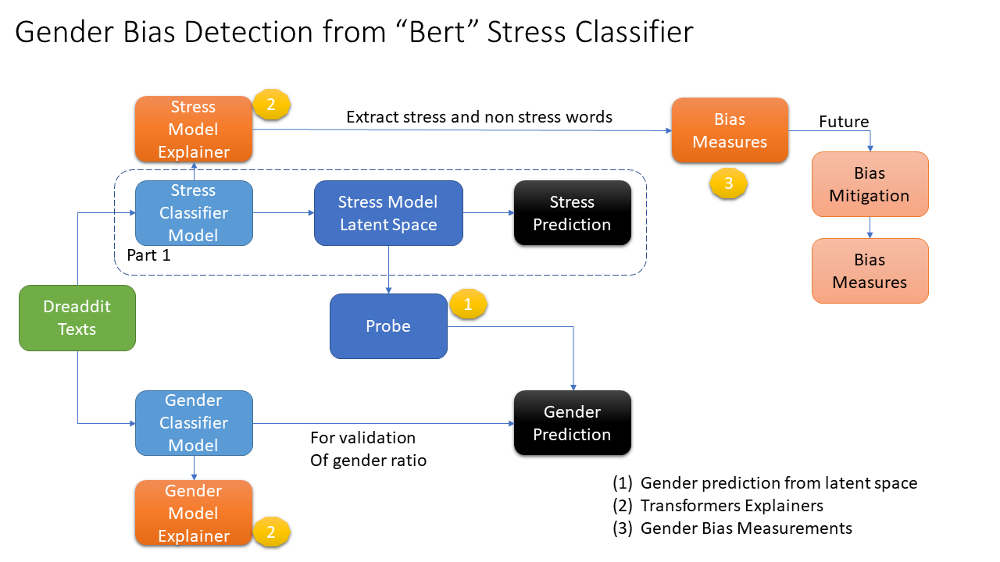

# Text based Stress Classification and Gender Bias Detection on “Dreaddit” Dataset

This is the code which was used as part an the Advanced ML course final project.

Reichman University, 2022

## Overview
Stress is considered to be a nearly universal human experience, particularly in the online digital world. While stress is sometimes considered as a motivator, too much stress is associated with many negative health outcomes, making its identification useful across a range of use cases. With many platforms such as Twitter, Reddit, and Facebook, the scientific community has access to a massive amount of data to study the daily worries and stresses of people across the world. Our anchor paper [Dreaddit: A Reddit Dataset for Stress Analysis in Social Media](https://arxiv.org/pdf/1911.00133.pdf) by Elsbeth Turcan, Kathleen McKeown(2019)", introduced a new text corpus of lengthy multi-domain social media data intended for the identification of stress.

**Part 1** deals with experiments that reproduced the Dreaddit's paper results. we trained a Bert based stress classifier on the [Dreaddit dataset](https://www.kaggle.com/datasets/ruchi798/stress-analysis-in-social-media).

In **Part 2** we investigated if our stress classifier model was capturing any gender representation, in other words we wanted to see if the predicted ‘stressed posts’ are gender biased and to measure the fairness of our model.
Measuring Bias in ‘Bert’ models is unlike measuring it in classical models such as GloVe and Word2Vec, where every word has a single vector embedding that represents it. Instead in a Contextualized Word Embedding Representations model such as in Bert (or ELMO), every token (word) may be represented by a different vector, based on the context of the word in a given sentence.
To measure the bias on our classifier we mainly followed the experiments proposed in Kurita, Keita, et al. in the paper  ["Quantifying social biases in contextual word representations"(2019)](https://homes.cs.washington.edu/~yuliats/papers/bias_in_bert.pdf)

## Architechture
</img>

## Code

This work includes 2 parts:

1. Reproduction of the results reported in "Dreaddit: A Reddit Dataset for Stress Analysis in Social Media by E.Turcan, K.McKeown (2019)
- Part 1 notebook: [dreaddit_paper_experiments.ipynb](https://github.com/lleviraz/bert-gender-bias/blob/main/dreaddit_paper_experiments.ipynb)

2. Gender Bias Detection for Stress texts in Bert's Contextualized embedding
- Part 2 notebook: [bert_gender_stress_bias.ipynb](https://github.com/lleviraz/bert-gender-bias/blob/main/bert_gender_stress_bias.ipynb)

## Full report 

- [bert_gender_stress_bias_report.pdf](bert_gender_stress_bias.pdf) (stay tuned....)

